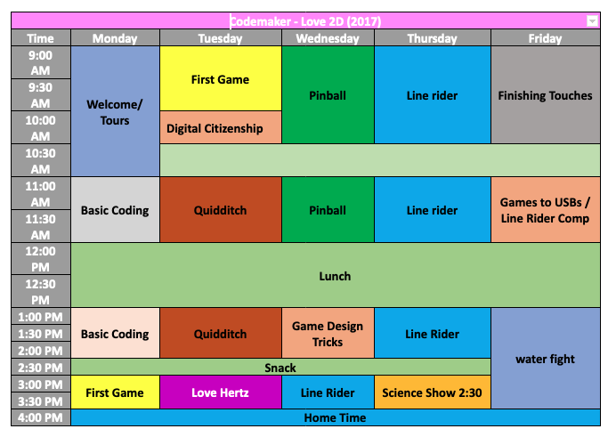

# CODEMAKERS Love2D Project Manual 2018

# Table of Contents

- SETUP
- Camp Schedule
- ACTIVITY: Intro Programming
- ACTIVITY: First Game 
- ACTIVITY: Digital Citizenship
- ACTIVITY: Quidditch
- ACTIVITY: Love hertz .
- ACTIVITY: Pinball .......2
- Tricks that will make your game better
- ACTIVITY: Liner Rider 
- ACTIVITY: Line Rider Eraser
- ACTIVITY: Game’s To Usb’s/Line Rider Comparison


# SETUP

Make sure the campers have the folder Files_For_Campers on their computer by the afternoon of the first day. There are many code templates that the campers will build code from in this folder. There is one file called **Give_at_ending/Game_tricks.pdf** that should not be given until after the **Game_tricks/Game_design workshop**

Have fun!

## How to use on windows computers

Watch the video how-to-use.mp4

# Camp Schedule

## 5 day



## 4 day


# ACTIVITY: Intro Programming

*BY: Sam Germain adapted from Carter Hill*

- GRADE and CAMP: Grade 7-9, Codemakers (Love 2D)
- TOPIC(s): Game Design, binary
- TIME: 120 mins
- OBJECTIVE: Learning the basics of programming in Lua

## MATERIALS

- ヽ(ຈ͜ل ຈ)ﾉ︵ ┻━┻

## SCIENTIFIC BASIS (learning outcomes - teach this)

### What is syntax? 

All coding languages are unique in how they operate, and the word syntax is used to describe them. For example the “syntax” for writing something to the console in Python or Lua is 

```Lua
print("something")
```

whereas with c++ it’s more like: 

```C++
cout << "something" << endl;
```

In the same way, one could say the “syntax” for saying hello in French is bonjour.

### Variables

Variables, put simply, are placeholders for data. They have an assigned name and a value that can be changed at almost any time. Variables in coding are not very different from variables in math. 

If we say that x – 3 = 1, we know that x = 4, x would be its name, and 4 would be its value. In Lua, variables can be assigned really easy, just by typing name = value. If there is already a variable called name, its value would be changed, and if not, it would simple create a value for it. 

Variables can hold the values of all kinds of different data types. The most obvious answer would be numbers. What other types of data can be used in computer code? If you want a string (a string of characters, like a sentence) you would say 

```Lua
myString = "Your sentence in quotes"
``` 

The quotations make the computer know that it’s a string variable type. Another important data type is Boolean, which can only have two values, can you guess what they are? (It’s True and False). 

```Lua
myBoolean = True
```

### Conditionals

Are bits of code that are only executed if a given condition is true. This is where computer and human language are most comparable. Let’s say you’re about to go get groceries you check your fridge and see that you’re out of milk, so you add it to your list. The next time you go to get groceries you still have some left, so you decide not to get milk. Next, somebody else in your house is going shopping, so you tell them “If we’re out of milk buy some!” which is very close to how conditionals are written in computer science. 

Let’s say we have a variable that is true if the milk jug is empty, so 

```Lua
outOfMilk = True
```

Then, our if statement would look like 

```Lua
if outOfMilk then 
    // ...
end
```

or 

```Lua
if outOfMilk == True then
    // ...
end
```

Or we could have a variable that is true if we have milk, so: 

```Lua
if milkNotEmpty == False then
    // ...
end
```

You can also use numbers in conditionals. For example, `if 4 == 4` would always turn true, and thus the code in that block will always execute. Or you could have a variable that shows how much milk is left, like `milkAmount = 10`. You could say that if the milk is almost gone, you should buy more. You can do that by using `<` and `>` which mean less than or greater than. So 

```Lua
if milkAmount < 3 then
// ...
```

would execute if your `milkAmount` is two or less.

### Functions

Functions, or procedures, are kind of like variables but for code. Let’s say we want a function that adds four to a given number. It would look like:

```Lua
function add(x, y)
    z = x + y
    return z
end
```

And then if I wanted to add two numbers together and assign it to a variable I would simply type 

```Lua
myVariable = add(4, 3)
```

Functions can have as many arguments as you want them to, or they could have 0 arguments at all. If they have no arguments, you have to remember to use the brackets anyway, there just won’t be anything between them.

### Objects

Objects behave like a container that can have variables(called attributes) and functions(called methods) attached to them. Lets use the analogy of a bike as our object. If we refer to samsbike.height we are referring to the height of sams bike, and if we refer to `samsbike.speed` we are referring to the speed of sams bike. If we say `mattsbike.speed` we are referring to the speed of matts bike.

### Loops

Our for loops are only going to loop through objects, because of this, they don’t have to really learn what for loops are, just how to loop through an object. In looping through an object we repeat the same series of instructions for each attribute of the objects. We LOOP through each of the attributes of the object and perform some code using each attribute

## Procedure

Get the kids to watch this video on [crash course programming](https://www.youtube.com/watch?v=l26oaHV7D40&index=13&list=PL8dPuuaLjXtNlUrzyH5r6jN9ulIgZBpdo)

The following exercises will take place on https://repl.it/repls/GloomyGummyGenericsoftware. Get the kids to visit this site Write each of the following examples on the board and get the kids to try to code their own example

Write this example of variable’s on the board and get them to try to code their own example

### Variables

```Lua
x = 3
print(x) -- should print 3
```

```Lua
y = 4 + x
print(y) --should print 7
```

### Conditional

```Lua
x = 3

if (x<5) then
    print("less than 5")
elseif (x<10) then
    print("less than 10")
else
    print("greater than 10")
end
```

### Functions

```Lua
function add(x, y)
    z = x + y
    return z
end

x = 2
y = 3
w = add(x,y)
print(w) --Should print 5
```

### Objects

```Lua
mattsbike = {}
samsbike = {}
samsbike.height = 172
mattsbike.height = 184
```

```Lua
print(samsbike.height) --Should print 172
print(mattsbike.height) --Should print 184
```

- If the kids are too confused, you can skip this next part on methods

```Lua
function samsbike.setheight(x)
    samsbike.height = x
end
```

```Lua
samsbike.setheight(150)
print(samsbike.height) --Should print 150
```

### For Loop

We are going to create an object that has 3 string variables. We are then going to loop through each variable and print the string.

#### Pseudocode

```Lua
bike = {}
bike.height = "1.2 m"
bike.speed = "20 km/hr"
bike.terrain = "Mountain"
```

```
for each variable in objects
    print the variable
end for loop
```

#### Lua Code

```Lua
strings = {}
bike.height = "1.2 m"
bike.speed = "20 km/hr"
bike.terrain = "Mountain"
```

```Lua
for _, item in pairs(objects) do
print(item)
end
--Should print
--1.2 m
--20 km/hr
--bike.terrain
```


# ACTIVITY: First Game 

*BY: Sam Germain*

- GRADE and CAMP: Grade 7-9, Codemakers (Love 2D)
- TOPIC(s): Game Developement
- TIME: 120 mins
- OBJECTIVE: To create our first game

## MATERIALS:

- ᕙ(░ಥ╭͜ʖ╮ಥ░)━☆ﾟ.*･｡ﾟ

## SCIENTIFIC BASIS (learning outcomes - teach this):

Games in love2d have 3 main functions. `love.load`, `love.update`, and `love.draw`. `love.load` is the function that operates when the game starts, it puts everything into the game that is there at the beginning. `love.update` records input from the user and determines what changes are to be made to the game. `love.draw` gives the output of the game to the user, it shows the display.

### Love.physics

`love.physics` is used to create objects that can interact with eachother. Objects can be **static**(fixated on the screen), or **dynamic**(move around). When a dynamic object hits a static object, it deflects off of it, in this way, collision detection is taken care of for us.

We will give the kids a template for the world that the game exists in. The template sets the
Each object has a minimum of 3 attributes

- body: Determines where the object exists within the frame and whether the object is static or
    dynamic.
    - Ex: `objects.ball.body = love.physics.newBody(world, 1700/2, 1000/2, "dynamic")`
- shape: Determines the shape of the object
    - Ex: `objects.ball.shape = love.physics.newCircleShape(20)`
- fixture: Puts the object in the game world
    - `objects.ball.fixture = love.physics.newFixture(objects.ball.body, objects.ball.shape, 1)`

### Objects

Objects are nothing more than a simple way of organising information. We are going to create 3 objects. 1 object is already created.

## PROCEDURE

### love.load

1. Get the kids to open their template for the first game. If they drag it over love.exe as is it should display a blue screen.
2. The first thing you’ll do is change the width of the ground from `200` to `1700`. `objects.ground.shape = love.physics.newRectangleShape(1700, 50)` At `1700` if the ball falls off the screen then it falls infinitely, because there is no ground that exists outside the screen. If you change it to `25000`, the ball still has something to fall on if it rolls off the screen, even though you can’t see it. They can open **tutorials/Ground_width.pdf** to view the photo’s below.

#### Ground Width: 200


#### Ground Width: 1700


#### Ground Width: 25000


3. Fill in the right hand values for the ball object. The template should match the complete version by the end. The comments specify what the values should be for the ball. They should be able to use the code for how the ground was made as a reference for how to code the ball.
4. Code the left and right hand sides for the blocks that the ball will bounce against. The code is almost identical to the two objects created before and the comments specify what to do

### Love.update

5. Code instructions for the ball to move when the left arrow key is hit, the right arrow key is already coded

### Love.draw

6. Uncomment the lines in love.draw that draw the shapes on the screen

7. Change the color of the ball to red. There is a commented out line for `love.graphics.setcolor`. They will have to uncomment this line and fill in the values specified in the comments. A few lines above they can see the code that was used to do this earlier


### Template


### Complete Code


# ACTIVITY: Digital Citizenship: Searching and Security

*Dominik Pytlak, Stephen and Jamie, adapted by Sam Germain*

- GRADE and CAMP: 7+
- TOPIC(s):
- TIME: 30 mins
- Set Up & Intro = Show some video’s on a screen

## MATERIALS (what you’ll need for one week of camp)

- The internet and a screen to show videos on

## What is Digital Citizenship?

Digital citizenship refers to the norms of appropriate, responsible, and healthy behaviour in technology use. This includes ethics, etiquette, digital literacy, safety and security. Your behaviour online is sourced back to you in real life so it is important to always represent yourself on the internet as you would in real life. Your words and actions on the internet will have an impact on you just as they would in the real world.

### Content online never goes away

There are websites that save old versions of websites Video on why you should care about privacy https://www.youtube.com/watch?v=85mu9PLWCuI

If you post something online, and then delete it, someone might have saved a copy, or the site you posted it on didn’t delete it

### How to tell if information is legit

https://www.youtube.com/watch?v=FxyKHp47EnQ

### Website evaluation methods

#### Author

- Who wrote this?
- What is their background?
- Is the author an individual or group?
- Is the author an expert on the topic
- Sharing opinions or facts?
- How does all of this shape what the author wrote?
- Click on Info/About if you can’t find the authors name

#### Motivation

- Is the webpage considered by a group organization or company
- What does the group stand to gain by convincing others of its points
- Was the information reviewed by others before it was published
- Is the information from a personal site (blog, etc.)
- .edu and .gov are more likely to be objective

#### Evidence

- Are there citations and links to other sources?
    - Are the citations accurate
- Can you verify the evidence from the site
- Are there many sources or just a couple timeliness
- When was the information published or last updated *BE SKEPTICAL*

### Security

Don’t just use things you’ve gotten online without checking them
- If an “antivirus” that you didn’t install is telling you that you have a virus... chances are, it’s a virus.
- Check the website at https://safeweb.norton.com/

Or google yourwebsite.com scam and if you get search results of people reporting it’s a scam, that’s a red flag

### Hacking techniques

- Key loggers can record your key’s entered in
- Fake Wap
    - Software that shows a fake wireless access point
    - Who owns it
    - Who’s using your data
    - Beware if free wifi doesn’t require a password or terms of use page
- Phishing
    - Replicates a legit looking site
    - A legit message that is actually fake
    - Anybody who’s asking for your password over email is a red flag
- Malware
    - Something that gets into your computer and messes things up
- Comes in from a sketchy source
- Don’t download programs and files from websites you don’t trust
- Bait and Switch
    - Buys ad space on a website and lures people to clicking on it
- Virus’s and Trojans
    - Send data from your computer continuously back to the hacker
- Keyloggers
    - Record your key strokes
    - Banks let you use their virtual keyboards to avoid this

### Efficient Use of Google

https://www.youtube.com/watch?v=LTJygQwYV

1. Boolean operators
    - AND – results with both criteria
    - OR – results with one or more of the criteria met
    - NOT – results that don’t contain something
        - Can also use the minus sign
2. Asterisk at the end of a word give different endings
    - Ex: Canad* returns results for Canada, Canadian, and Canadians
    - https://www.youtube.com/watch?v=R0DQfwc72PM
3. Quotation marks
    - Assures the words show up in the order they are within the quotation marks
4. Can upload an image to google images and search for similar images that way
    - Finds the origin of a specific image
5. Related:url
    - Finds similar websites
6. Filetype:pdf
    - Finds specific file types
7. Intitle: your search term
    - Displays sites that have the search term in their title

## Procedure

[Video on why you should care about privacy](https://www.youtube.com/watch?v=85mu9PLWCuI)

Watch This video on privacy Codemakers- Gamedev\Videos_For_Digital_CitizenShip\privacy

[Video on how to tell how reliable information is](https://www.youtube.com/watch?v=FxyKHp47EnQ)

Go over the types of Scam’s people try to pull as described under security. Watch this video on Scam Baiting: codemakers- Gamedev\Videos_For_Digital_CitizenShip\Ted_Talk_On_Scambaiting.mp

[Video on googling better](https://www.youtube.com/watch?v=LTJygQwYV)

Give each kid a copy of Google_tips.pdf

[Can the emmys be hacked (shows how fishing works)](https://www.youtube.com/watch?v=fs_eQQZEZRY)

# ACTIVITY: Quidditch

*BY: Sam Germain*

- GRADE and CAMP: Grade 7-9, Codemakers (Love 2D)
- TOPIC(s): Game Developement
- TIME: 150 mins
- OBJECTIVE: To learn how to manipulate the camera

## MATERIALS:

- 😐

## SCIENTIFIC BASIS (learning outcomes - teach this):

### `love.physics`

We perform camera movment in love2d by creating a camera object that has 2 attributes, an x and a y coordinate

```Lua
Camera = {
    x = 0,
    y = 0
}
```

We can set these values to change when we press an arrow key

```Lua
if love.keyboard.isDown("right") then --RIGHT ARROW BUTTON IS DOWN then
    Camera.x = Camera.x + 5
end
```

We then subtract these x and y coordinates from each of the objects within the game to look like things are moving.

```Lua
love.graphics.polygon(
    'fill',
    ramp.x - Camera.x,
    ramp.y - Camera.y,
    ramp.x2 - Camera.x,
    ramp.y - Camera.y,
    ramp.x2 - Camera.x,
    ramp.y2 - Camera.y
)
```


Here we change the position that we draw each of the objects at, the screen does not actually move, all the objects on the screen are just continually redrawn at a position that is further to the left.

Or we can set them to be locked on to a particular object

```Lua
Camera.x = wizard.body:getX() - love.graphics.getWidth()/2 --The subtraction is done so that the camera is centered on the wizard, instead of the wizard being at the side of the screen_
```


The game is set up to show the first type of movement when the game is paused, and the second type of movement when the game is not paused.

## PROCEDURE

Get the kids to open the **tutorials/Camera_movement.pdf** file and explain camera movment to them.
Get the kids to open the `main.lua` and `Camera.lua` files within their **Quidditch** folder.

### Camera Template

The kids must edit the template so that the `Camera.update` function includes functionality for moving to the Camera right and down, the adjustments are specified in the comments.

They must also update the `Camera:follow` function so that the camera also follows the wizard vertically, the adjustments are specified in the comments.


### Complete Camera Code


#### `love.update` template

The kids must edit the code so that a force is applied on the wizard to move right, up and down with the right, up and down arrow keys. The wizard will only move when the game is not paused.


#### `love.update` completed code


#### `love.draw` template

The kids must subtract `Camera.x` from all the objects x coordinates, and subtract `Camera.y` from all the objects y coordinates. The objects include the ramps, the ground, the wizard, and the hoops. Have them test out the code after each subtraction and let them see what happens.


#### Love.draw completed code


# ACTIVITY: How to use the “Love Hertz 2.0” Game Engine

*BY: Carter Hill*

- GRADE and CAMP: 7+
- TOPIC(s):
- TIME: 1 hour
- Set Up & Intro =
- Testing Substances =
- Identify Mystery Substance =

### SCIENTIFIC BASIS (learning outcomes - teach this)

Love Hertz 2.0 is a new version of the Love Hertz game engine used in last year’s Codemaker’s. It has been recoded from the ground up to dynamically use its own in-game level editor. How it works is, when the game starts up, it loops through certain image folders, and automatically creates a placeable object within the game based off its image. The image will then follow the mouse, and other placeable objects can be selected by using the scroll wheel. They can then be set into the level by clicking the primary (left) mouse button, or deleted after being placed with the secondary (right) mouse button. This means that the kids will be able to create their own tiles and objects for the game. Once they’re shown how it works, all children will be able to easily create and play their own games. Editing the code for this game engine is not recommended, as it’s already in a working and robust state. However, they will be given two copies, so if they want to fiddle with the code, they can still have an untouched (and working) copy. We will, however, be coding our own (more basic) version over the week, and so make sure they know that more coding will be coming if they are really wanting to do that.

## PROCEDURE

1. On their USB stick, there will be a folder titled **LoveHertz2.0-FINAL**. Open this folder and take a look inside.
2. Within the game folder, there will be another folder called **images**. Open this folder as well. Inside, you will see, yet again, more folders. Each of these folders with create an object in the game with certain properties. Images in the **tiles** folder will need to be 64x64 pixels in size and will be placed in a grid pattern. Images place in the **static** folder will have no special properties, but can also be placed on the screen. We will worry about enemies later.


# ACTIVITY: Pinball

*BY: Sam Germain*

- GRADE and CAMP: Grade 7-9, Codemakers (Love 2D)
- TOPIC(s): Game Developement
- TIME: 120 mins

## OBJECTIVE

To learn how to program a pencil tool on the screen

## MATERIALS

- 😐

## SCIENTIFIC BASIS (learning outcomes - teach this)

Drawing is done on the screen by connecting many lines together. When a shape is drawn like this It is done so by putting multiple straight lines onto the screen. Each line has 2 x coordinates and 2 y coordinates.

There is an example of how to draw a line within `main.lua` in the pinball folder. It draws a line by default within the game.

```Lua
line = {}
line.x1 = 1675
line.x2 = 1625
line.y1 = 100
line.y2 = 100
line.body = love.physics.newBody(world, 0, 0, "static")
line.shape = love.physics.newEdgeShape(line.x2, line.y2, line.x1, line.y1)
line.fixture = love.physics.newFixture(line.body, line.shape, 5)
table.insert(objects.lines,line)
```

We want to draw lines only when the mouse is down. We do this with an if statement

```Lua
if love.mouse.isDown(1) then
```

And obtain the x and y coordinates with functions like the following

```Lua
drawn_x = love.mouse.getX()
```

But we need to have 2 x and y coordinates in order to draw a line. Because of this we have the variables `oldx` and `oldy` originally set to `nil`. After calling `love.mouse.getX()` check if `oldx` is set to `nil`

```Lua
if oldx then
```

If `oldx` is not `nil` then draw a new line with `drawn_x` and `drawn_y` as the x1 and y1 coordinates, and `oldx` and `oldy` as the y1 and y2 coordinates. After the if statement set `oldx` and `oldy` to be equal to `drawn_x` and `drawn_y`, this is so you will have continuous lines.

Notice how `drawn_x` and `drawn_y` in the picture above become `old_x` and `oldy`

**Setting `oldx` and `oldy` to nil**


## Procedure

Get the kids to open their **tutorial/Drawing_Line_Objects.pdf** file and explain drawing lines to them Get the kids to open the `main.lua` file stored within their folder.

### Love.draw

The kids must code a for loop that draws all the lines from `objects.lines` onto the screen. They can refer to the quidditch game for reference on how to draw things in a loop. There is already one line programmed in `objects.lines` so a line should show when you draw this.

### Love.update

The if statement `if love.mouse.isDown(1) then` is already in the template that will be given to the kids. All of the code within the update function will be within this if statment

The variable `drawn_x` is already set to the mouses `x` coordinate. The kids must set the variable `drawn_y` to be the mouses `y` coordinate

There is a nested if statement checking if `oldx` is not `nil`. Within this if statement there is a line object with its x coordinates set. The kids must 
- set the `y` coordinates of the line. 
- create a `body`, `shape`, `fixture` for the line (They can refer to the first ball game for reference on how to do this)
- add the line to the list `objects.lines` 

Outside the nested if statement the variables `oldx` and `oldy` are set to `0`. The kids must set these variable to `drawn_x` and `drawn_y`.


# ACTIVITY: Tricks that will make your game better

*BY: Sam Germain*

- GRADE and CAMP: Grade 7-9, Codemakers (Love 2D)
- TOPIC(s): Game Developement
- TIME: 60 mins
- Intro = 20 mins
- Challenges = 60 mins
- Conclusion = 5 mins

## OBJECTIVE

To teach tricks that will make your game better

## SCIENTIFIC BASIS (learning outcomes - teach this):

## 4 Crucial Components of Game Design.

1. A clear goal, or incentive to carry on.
    - In Mario we know that we have to reach the flag pole at the end of the level. In open world exploration games, we’re given a big world and a means to explore it.
2. Every game has rules, it’s literally what makes games what they are
    - A sport like hockey would be a game with tons of rules, such as getting a penalty for tripping. Another rule could even be that a team gets a point if the puck enters the opponents net. Ask the group what kind of rules Mario, or any other video game, has (things like “it is game over when you run out of lives”, or “you get hurt if you get hit by an enemy or a trap”).
3. Conveyance: how well information is communicated. What could a designer of a video game do to explain rules. Tutorials? Sometimes, but In most cases, a player should be able to understand the rules without being explicitly told much at all
    - In Mario, you know that the blocks with question marks on them have prizes. If you were the first person to play Mario ever, you would figure this out very quickly because the stand out and look very unique from the other blocks.
4. A balance in challenge. If a game is too difficult to play or understand, players will get frustrated and not enjoy it. If a game is too easy, players may get bored of it quickly, unless there is a sort of creative component to it. (The Sims would be horribly boring with only one type of floor tile or wallpaper, also Assassin’s Creed 3). Once you find that perfect balance of challenge, it’s also important to give players a sort of “break” once in a while. Having no change of pace will often begin to bore or tire players as well, so a section of easier play every half an hour or so will keep the players engaged and wondering what will come next.
    - Games will often do this by adding quick story heavy sections, or action games will often give you a puzzle to solve. That may not apply to us because we won’t be making very long games, but it’s a good knowledge to have.

## PROCEDURE

The folder **Destroyer_Executables** contains 14 versions of the same game, each with a slight modification to it. Get the kids to open up destroyer_1 and tell them they should place their mouse behind their keyboard and that they will need the extra desk space(They actually can’t play the game without the mouse). After a minute ask “Who’s having fun!” and they’ll most likely say they don’t know what to do. Explain the first 3 principles of game design and that this game wasn’t fun because the rules and goal weren’t conveyed to you. Now tell them they actually need to use the mouse to blast the emoji. The goal of the game should be pretty clearly conveyed once they start playing with the mouse.

The first level of the game is pretty hard, and I almost gave up on it because it was so hard. I’m assuming the kids will have equal frustration but I could be wrong. Explain the 4th crucial component of Game Design and that if a game is too difficult people will get frustrated and not want to play it. Labelled on the next picture is a location of where the first shot needs to be to win the level, the game is regular difficulty after that.

After playing with the first game for a bit, get them to open the second game, then the third, the fourth.... All of these games are the same with a small adjustment added to each one that is intended to make the game more fun. Let them play around with each game for a little bit until they understand the concept of each change. Below is an explanation of each of the changes

### Destroyer_1: Basic

- The most simplified version of the destroyer game

### Destroyer_2: Simple sounds effects

- When the player jumps or hits a wall you hear small sounds

### Destroyer_3: Object Particles

- Shows permanence, things happen to the world when you do something to them
    - Other examples of Permanence
        - When bullets miss you can see bullet holes in the wall
        - Bullet Shells
        - Smoke

### Destroyer_4: Player Particles

- Shows the effect that impact has on the player with some hit animation

### Destroyer_5: Explosions

- Blocks go flying and the game feels more exciting

### Destroyer_6: Bigger Explosions

- There’s even more blocks and they go flying further! Why did we even have those small explosions to begin with?

### Destroyer_7: Background Lag/Camera Lerp

- The Background is animated to lag slightly behind the animation of the player.

### Destroyer_8: Screen shake

- The screen shakes when the player blasts. This makes the blast feel much more powerful

### Destroyer_9: Motion blur

### Destroyer_10: Color

- When the platforms explode the blocks from the platforms are a range of colors

### Destroyer_11: More Bass

- The sound effect from the player blasting is much more bassy and the blast feels more powerful.
    - This sound effect is actually the result of 5 different blast sounds playing simultaneously.

### Destroyer_12: Slow Motion

- There is a slower framerate when you lose the game.
    - Feels more epic.
    - Gives some meaning to the game.

### Destroyer_13: Huge explosions (The executables are bogged down, so you can skip this one)

- Let’s just make the platform blocks fly all over the place!

### Destroyer_14: Music

## Bonus (Some extra info if it’s wanted, but you don’t have to teach this)

Based off [this video](https://www.youtube.com/watch?v=AJdEqssNZ-U&feature=youtu.be)
- Contains swears, don’t show to campers

Some other tricks that will make your game better

2. Basic animations
3. Low enemy Hp
4. High rate of fire

5. More enemies

6. Bigger bullets

7. Muzzle Flash

- There is a small yellow circle around the gun when the player shoots
8. Faster Bullets
9. Less accuracy

10. Impact effects

- That cloud is from an enemy being hit
11. Hit animation

- That white part is the same shape as an enemy and shows them being hit.
12. Enemy knockback
    - Enemies move back when you hit them
13. Camera Position
14. Player Knockback
    - Player moves back when shooting
15. Sleep
    - Slight delay on impact
        - Brain has more time to process the game when something important happens
16. Gun delay
    - Gun lags behind character and looks like the character is carrying it
    - Gun kicks back
17. Strafing
    - the technique of moving the player's character from side to side, rather than forward or backward
18. Shoot multiple bullets at a time


# ACTIVITY: Liner Rider 

*BY: Sam Germain*

- GRADE and CAMP: Grade 7-9, Codemakers (Love 2D)
- TOPIC(s): Game Developement
- TIME: 60 mins
    - Intro = 20 mins
    - Challenges = 60 mins
    - Conclusion = 5 mins

## OBJECTIVE

To combine the skills learned into a final project

## SCIENTIFIC BASIS (learning outcomes - teach this):

All the necessary skills have already been taught to the kids, they must use their previous code to figure out how to make this project

## PROCEDURE

Get them to visit [http://www.linerider.com](http://www.linerider.com) and play line rider for 5 minutes or so, so they have an idea of the game that they are trying to make.

Get the kids to open the `main.lua`, and `camera.lua` files within the **line_rider** folder, they DO NOT need to open the `eraser` file(that comes later).

### Love.load()

The 4 variables `drawn_x`, `drawn_y`, `oldx` and `oldy` must be created and initialized to `0` or `nil`

```Lua
drawn_x = 0 --position to be drawn on when the mouse is pressed
drawn_y = 0 --position to be drawn on when the mouse is pressed
oldx = 0
oldy = 0
```

The `rider` must be created and put into the world. The rider is actually just a rectangle, with the toboggan rider drawn overtop of the rectangle, this was coded for the kids in the quidditch game, although the kids did not code it themselves. `friction` should be set to `0`, so that the rider can do loops and stuff. The kids have not learned how to do this, but it’s in the comments. 

```Lua
objects.rider = {}
objects.rider.body = love.physics.newBody(world, 650/2, 0, "dynamic")
objects.rider.width = 40
objects.rider.height = 30
objects.rider.shape = love.physics.newRectangleShape(objects.rider.width, objects.rider.height)
objects.rider.fixture = love.physics.newFixture(objects.rider.body, objects.rider.shape)
objects.rider.fixture:setFriction(0.0)
objects.rider.img = love.graphics.newImage("images/tobboggan.png")_
```

### `love.update()`

The `if not pause` if statement must be modified to include both of the `Camera` functions

```Lua
if not pause then
    world:update(dt) --this puts the world into motion
    Camera:follow(dt, objects.rider)
else
    Camera.update(dt)
end
```

Code must be put in to draw a line if the mouse is down. This can basically just be copied from the
pinball game, but `Camera.x` and `Camera.y` must be subtracted from `drawn_x` and `drawn_y`

```Lua
if love.mouse.isDown(1) then
    drawn_x = love.mouse.getX() + Camera.x --x coordinate of the mouse
    drawn_y = love.mouse.getY() + Camera.y --y coordinate of the mouse
    if oldx ~= nil then
        line = {}
        line.x1 = oldx
        line.x2 = drawn_x
        line.y1 = oldy
        line.y2 = drawn_y
        line.body = love.physics.newBody(world, 0, 0, "static")
        line.shape = love.physics.newEdgeShape(drawn_x, drawn_y, oldx, oldy)
        line.fixture = love.physics.newFixture(line.body, line.shape, 5)
        table.insert(objects.lines, line)
    end
    oldx = drawn_x
    oldy = drawn_y
else
    oldx = nil
    oldy = nil
end
```

### love.draw()

The rider must be drawn. The angle variable makes it so that the rider image turns in accordance with the way the rectangle is facing, so when the top of the rectangle is facing down, the top of the rider image is facing down. `orient_x` and `orient_y` set the center of rotation for the image. When `orient_x` and `orient_y` are set to the top left corner, the image does not touch the surface it’s resting on when upside down.

```Lua
rider_img = objects.rider.img
rider_x = objects.rider.body:getX() - Camera.x
rider_y = objects.rider.body:getY() - Camera.y
rider_angle = objects.rider.body:getAngle()
orient_x = objects.rider.img:getWidth()/2
orient_y = objects.rider.img:getHeight()/2
love.graphics.draw(rider_img, rider_x, rider_y, rider_angle, 1, 1, orient_x, orient_y )
```

They must draw the lines that are drawn on the screen. This is done exactly like the pinball game but `Camera.x` and `Camera.y` must be subtracted from the lines `x` and `y` coordinates

```Lua
for _, line in pairs(objects.lines) do
    love.graphics.line( line.x1 - Camera.x, line.y1 - Camera.y, line.x2 - Camera.x, line.y2 - Camera.y)
end
```

### Camera.lua

- For the four day camp, they did not do the quidditch exercise, so the camera is coded for them mostly. They will have to subtract `Camera.x` and `Camera.y` from their other objects however, so explain a little bit about the camera, just so they kind of understand why they have to subtract it.

The `Camera` object exists as an empty object

```Lua
Camera = {}
```

`x` and `y` coordinates for camera must be created and set to `0`

```Lua
Camera = {
    x = 0,
    y = 0
}
```

### Camera.update

The actions for the arrow keys must be coded into camera.update. This includes adding and subtracting from `Camera.x` and `Camera.y` if an arrow is being pressed. This function only operates when the game is paused.

```Lua
if love.keyboard.isDown("right") then --RIGHT ARROW BUTTON IS DOWN then
    Camera.x = Camera.x + 5
elseif love.keyboard.isDown("left") then
    Camera.x = Camera.x - 5
end
```

```Lua
if love.keyboard.isDown("up") then
    Camera.y = Camera.y - 5
elseif love.keyboard.isDown("down") then
    Camera.y = Camera.y + 5
end
```

### Camera.follow

When the game is not paused, the `Camera.follow` function is used to set `Camera.x` and `Camera.y` to the coordinates of the rider.

```Lua
Camera.x = rider.body:getX() - love.graphics.getWidth()/2
Camera.y = rider.body:getY() - love.graphics.getHeight()/2
```

## ACTIVITY: Line Rider Eraser

*BY: Sam Germain*

- GRADE and CAMP: Grade 7-9, Codemakers (Love 2D)
- TOPIC(s): Game Developement
- TIME: 60 mins

### OBJECTIVE

To put the eraser into line rider

## SCIENTIFIC BASIS (learning outcomes - teach this):

The eraser will be coded in the work on the right click of the mouse. A variable, which we will call `erase_x` and `erase_y` will be assigned to the `x` and `y` coordinates of the mouse we the mouse is held down. We need to loop through each of our lines and check if the line spans over the spot we are trying to erase. The pictures below explain the four scenario’s where a line would span over the spot we are trying to erase.


### Indices

The code is in there for them, but here’s an explanation of whats going on. Each line also has an index in a table. The first line segment is the first one in the table, and the second line segement is the second line in the table. If we set a `line_counter` to `0`, loop through `objects.lines`, and increase `line_counter` by `1` every time we execute the loop, then `line_counter` is always the index of the line we’re looking at.


From this image, we can see that when looping through all our lines, when we are on our first line, the index is equal to `1`, when we are on our second line, the index is equal to `2`, so if we delete the line with index `2`, we are deleting the purple line.

### PROCEDURE

If there is no more time

- give the kids the `eraser.lua` file
- put `require("eraser")` at the top of `main.lua`
- put `erase()` into `draw.update()`

Otherwise

- they must edit their `eraser.lua` file so that it works as an actual eraser
- if the eraser is within the range of the line, I use `line.body:setType("dynamic")` to make the line fall, this doesn’t actual delete the line, but the line won’t interfere with the game anymore
- Using `table.remove(objects.lines, line_index)` is a comment in the file. If they uncomment this and place it in the correct nest, then the line should no longer be drawn.
- put `require("eraser")` at the top of `main.lua`
- put `erase()` into `draw.update()`


# ACTIVITY: Game’s To Usb’s/Line Rider Comparison

*BY: Sam Germain*

- GRADE and CAMP: Grade 7-9, Codemakers (Love 2D)
- TOPIC(s): Game Developement
- TIME: 60 mins

## OBJECTIVE

To get games onto usb. Also to compare the line rider they built to the official line rider and try to get the kids thinking about how they would put the extra features in.

## MATERIALS:

- | (• ◡•)| (❍ᴥ❍ʋ)

## PROCEDURE:

- Get the kids to open their How_to_put_games_onto_usb_sticks.pdf file. They can follow the instructions within this pdf to get their games onto usbs.
- If there is time get them to visit [http://www.linerider.com](http://www.linerider.com) and see the differences in this line rider. Try to get them to figure out what kind of programming they could do to achieve these distances.
- For the red lines some code could be written that would be something like, if the rider is on the line, applyForce to the rider
- For the green lines, you could have an if statement checking if green is true, and if it is, exclude creating a fixture for those line objects
- When the line rider falls off the sled, you could have an if that checks the angle and position of the rider and if the angle is a certain value when the rider hits the line, then you create 2 objects(one rider and one sled) to replace the previous object and sled.
- For the arms and legs, you can create multiple rectangles that must stay attached to eachother, but each will have their own center of gravity
